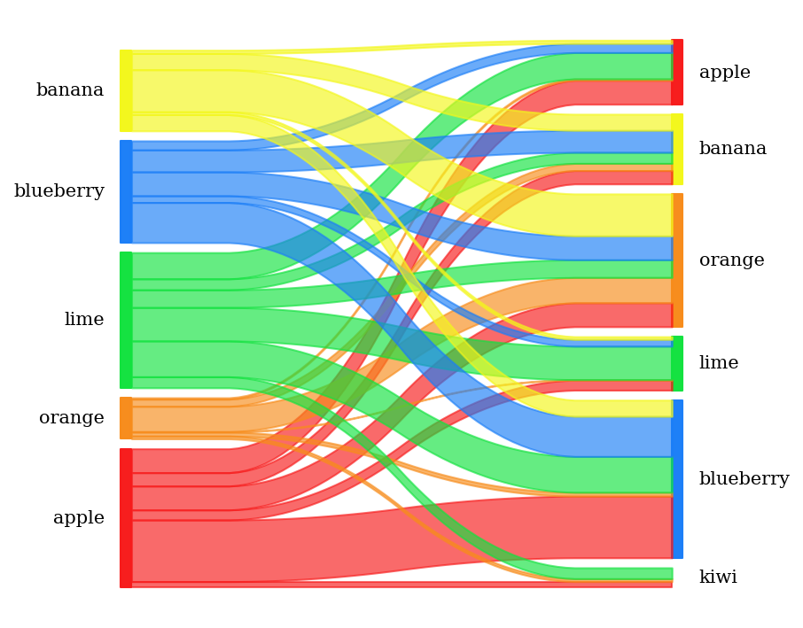

# pySankey

Uses matplotlib to create simple <a href="https://en.wikipedia.org/wiki/Sankey_diagram">
Sankey diagrams</a> flowing only from left to right.

## Requirements

Requires python-tk (for python 2.7) or python3-tk (for python 3.x) you can
install the other requirements with:

``` bash
    pip install -r requirements.txt
```

## Example

With fruits.txt :

<div>
<table border="1" class="dataframe">
  <thead>
    <tr style="text-align: right;">
      <th></th>
      <th>true</th>
      <th>predicted</th>
    </tr>
  </thead>
  <tbody>
    <tr>
      <th>0</th>
      <td>blueberry</td>
      <td>orange</td>
    </tr>
    <tr>
      <th>1</th>
      <td>lime</td>
      <td>orange</td>
    </tr>
    <tr>
      <th>2</th>
      <td>blueberry</td>
      <td>lime</td>
    </tr>
    <tr>
      <th>3</th>
      <td>apple</td>
      <td>orange</td>
    </tr>
    <tr>
      <th>...</th>
      <td>...</td>
      <td>...</td>
    </tr>
    <tr>
      <th>996</th>
      <td>lime</td>
      <td>orange</td>
    </tr>
    <tr>
      <th>997</th>
      <td>blueberry</td>
      <td>orange</td>
    </tr>
    <tr>
      <th>998</th>
      <td>orange</td>
      <td>banana</td>
    </tr>
    <tr>
      <th>999</th>
      <td>apple</td>
      <td>lime</td>
    </tr>
  </tbody>
</table>
<p>1000 rows × 2 columns</p>
</div>

You can generate a sankey's diagram with this code:

```python
import sankey
import numpy as np
import matplotlib.pyplot as plt
import pandas as pd

pd.options.display.max_rows=8
%matplotlib inline

df = pd.read_csv('fruits.txt',sep = ' ',names=['true','predicted'])
colorDict =  {'apple':'#f71b1b','blueberry':'#1b7ef7','banana':'#f3f71b',
              'lime':'#12e23f','orange':'#f78c1b'}
sankey(df['true'], df['predicted'], aspect=20, colorDict=colorDict,
              fontsize=1, figureName="fruit")
```



You could also use weight:

```
,customer,good,revenue
0,John,fruit,5.5
1,Mike,meat,11.0
2,Betty,drinks,7.0
3,Ben,fruit,4.0
4,Betty,bread,2.0
5,John,bread,2.5
6,John,drinks,8.0
7,Ben,bread,2.0
8,Mike,bread,3.5
9,John,meat,13.0
```

```python
import sankey
import numpy as np
import matplotlib.pyplot as plt
import pandas as pd
pd.options.display.max_rows=8
%matplotlib inline
df = pd.read_csv('customers-goods.csv',sep = ',',names=['id', 'customer','good','revenue'])
# actual call is left as an exercice to the reader but it could be something like
# sankey(left=df['customer'], right=df['good'], rightWeight=df['revenue'],
#        aspect=20, colorDict=colorDict, fontsize=20, figureName="customer-good")
```


