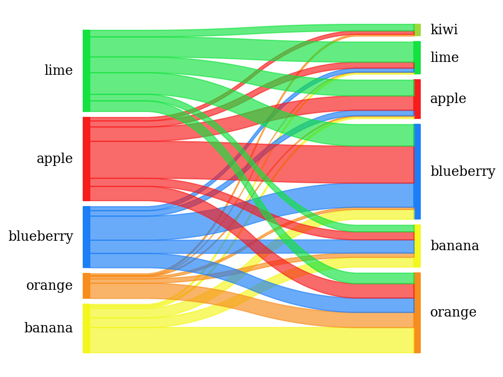

# pySankey

Uses matplotlib to create simple <a href="https://en.wikipedia.org/wiki/Sankey_diagram">
Sankey diagrams</a> flowing only from left to right.

[](https://badge.fury.io/py/pySankeyBeta)
[](https://travis-ci.org/Pierre-Sassoulas/pySankey)
[](https://coveralls.io/github/Pierre-Sassoulas/pySankey?branch=master)
[](https://github.com/ambv/black)

## Requirements

Requires python-tk (for python 2.7) or python3-tk (for python 3.x) you can
install the other requirements with:

``` bash
    pip install -r requirements.txt
```

## Example

With fruits.txt :

<div>
<table border="1" class="dataframe">
  <thead>
    <tr style="text-align: right;">
      <th></th>
      <th>true</th>
      <th>predicted</th>
    </tr>
  </thead>
  <tbody>
    <tr>
      <th>0</th>
      <td>blueberry</td>
      <td>orange</td>
    </tr>
    <tr>
      <th>1</th>
      <td>lime</td>
      <td>orange</td>
    </tr>
    <tr>
      <th>2</th>
      <td>blueberry</td>
      <td>lime</td>
    </tr>
    <tr>
      <th>3</th>
      <td>apple</td>
      <td>orange</td>
    </tr>
    <tr>
      <th>...</th>
      <td>...</td>
      <td>...</td>
    </tr>
    <tr>
      <th>996</th>
      <td>lime</td>
      <td>orange</td>
    </tr>
    <tr>
      <th>997</th>
      <td>blueberry</td>
      <td>orange</td>
    </tr>
    <tr>
      <th>998</th>
      <td>orange</td>
      <td>banana</td>
    </tr>
    <tr>
      <th>999</th>
      <td>apple</td>
      <td>lime</td>
    </tr>
  </tbody>
</table>
<p>1000 rows × 2 columns</p>
</div>

You can generate a sankey's diagram with this code:

```python
import pandas as pd
from pysankey import sankey

pd.options.display.max_rows = 8
df = pd.read_csv(
    'pysankey/fruits.txt', sep=' ', names=['true', 'predicted']
)
colorDict = {
    'apple':'#f71b1b',
    'blueberry':'#1b7ef7',
    'banana':'#f3f71b',
    'lime':'#12e23f',
    'orange':'#f78c1b',
    'kiwi':'#9BD937'
}
sankey(
    df['true'], df['predicted'], aspect=20, colorDict=colorDict,
    leftLabels=['banana','orange','blueberry','apple','lime'],
    rightLabels=['orange','banana','blueberry','apple','lime','kiwi'],
    fontsize=12, figureName="fruit"
)
# Result is in "fruit.png"
```



You could also use weight:

```
,customer,good,revenue
0,John,fruit,5.5
1,Mike,meat,11.0
2,Betty,drinks,7.0
3,Ben,fruit,4.0
4,Betty,bread,2.0
5,John,bread,2.5
6,John,drinks,8.0
7,Ben,bread,2.0
8,Mike,bread,3.5
9,John,meat,13.0
```

```python
import pandas as pd
from pysankey import sankey

df = pd.read_csv(
    'pysankey/customers-goods.csv', sep=',',
    names=['id', 'customer', 'good', 'revenue']
)
weight = df['revenue'].values[1:].astype(float)
sankey(
    left=df['customer'].values[1:], right=df['good'].values[1:],
    rightWeight=weight, leftWeight=weight, aspect=20, fontsize=20,
    figureName="customer-good"
)
# Result is in "customer-good.png"
```


## Package development

### Lint

	pylint pysankey

### Testing

	python -m unittest

### Coverage

	coverage run -m unittest
	coverage html
	# Open htmlcov/index.html in a navigator
